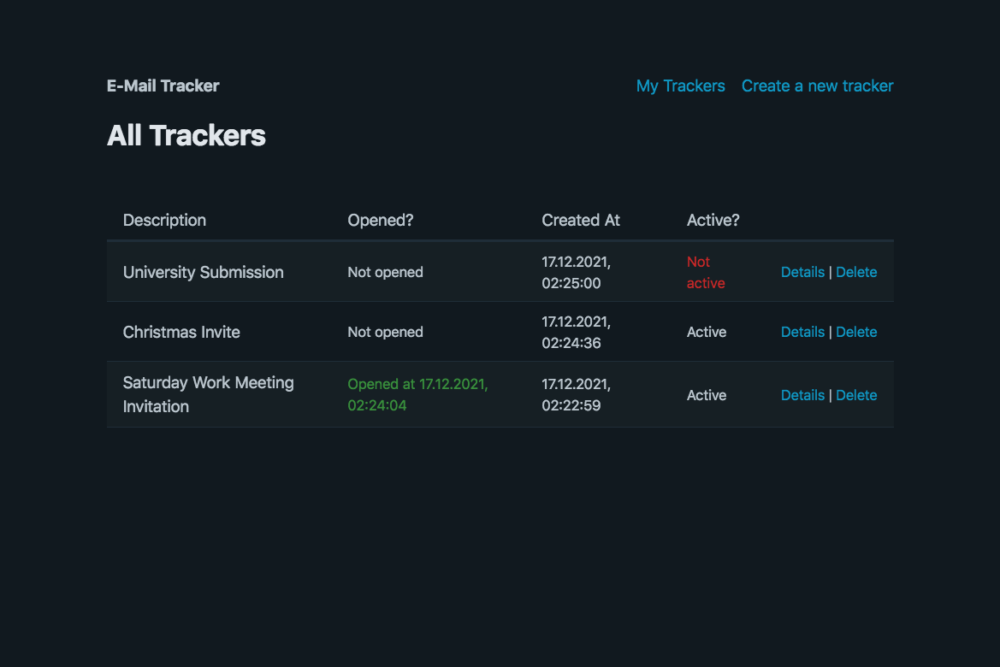
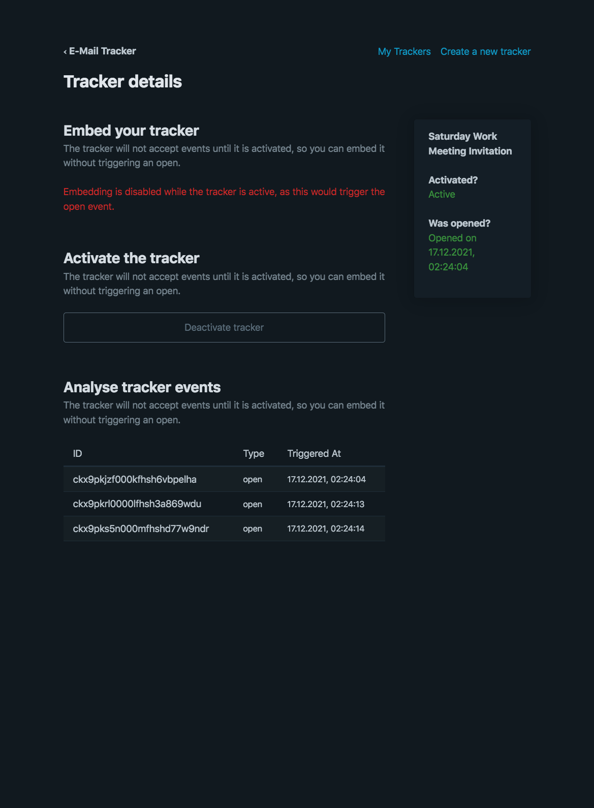
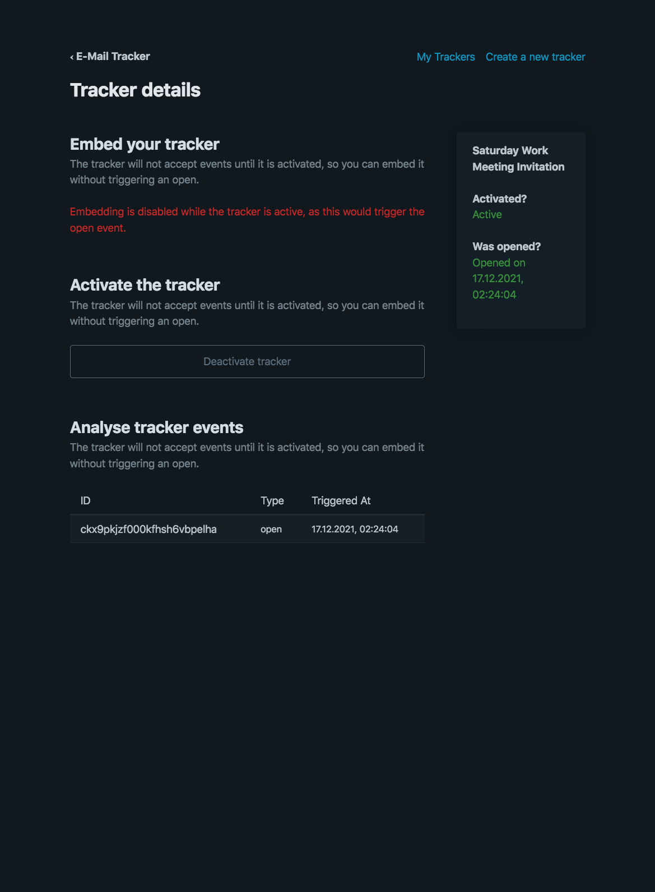
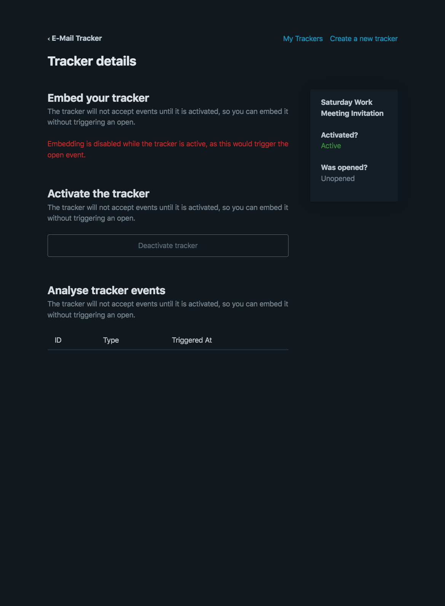
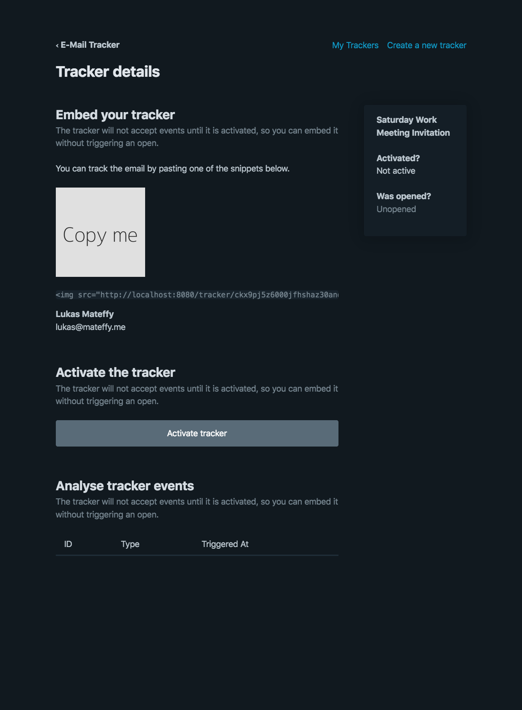
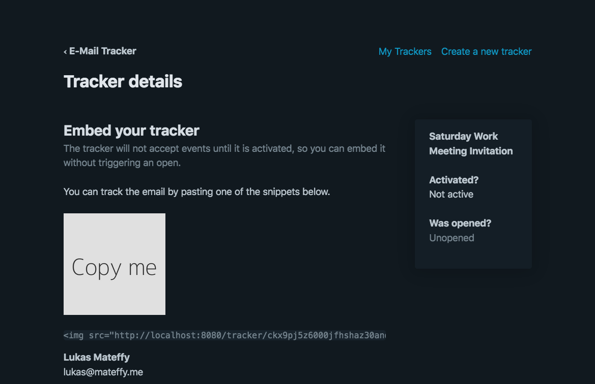
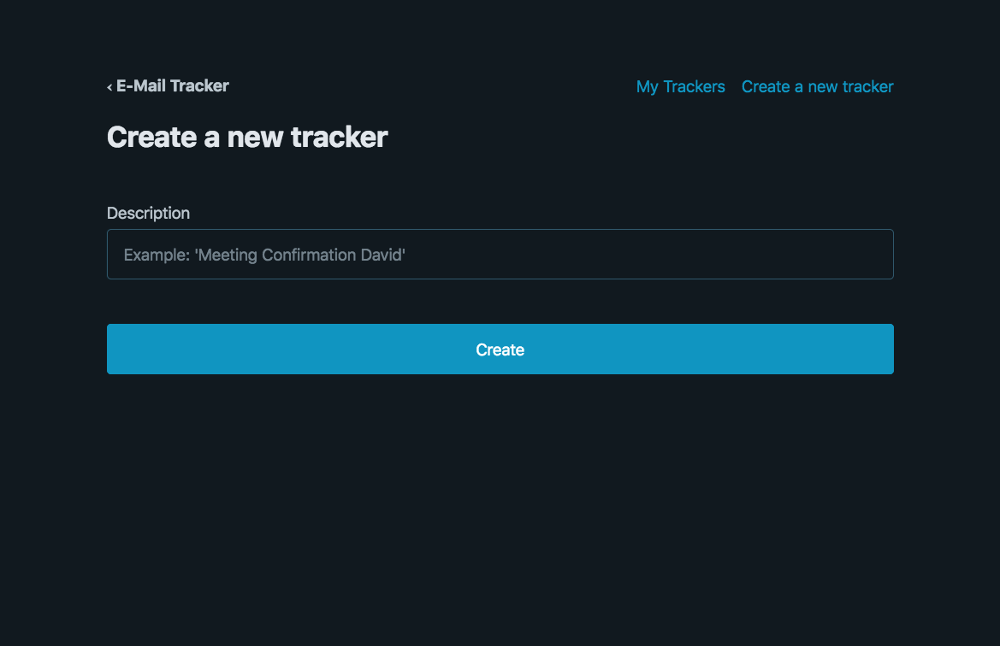
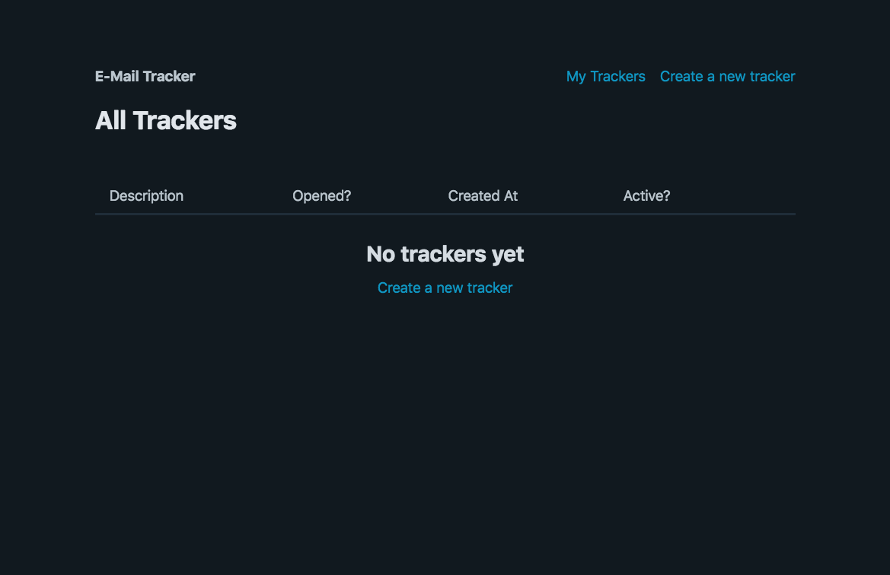

# email-tracker

A simple server to track email opens

## Usage

### Using with Docker

You can download the package from npm.

```bash
docker pull capevace/email-tracker
```

### Using with npm

You can download the package from npm.

```bash
npm i -g email-tracker
```

## Environment Variables

-   `PORT` (Number): set the port for the HTTP server

    Example:

    ```bash
    PORT=3000 email-tracker
    ```

-   `DB_PATH` (String): set the DB path

    Example:

    ```bash
    DB_PATH=../data/emails.db email-tracker
    ```

## Screenshots

| a                                                     | a                                                     |
| ----------------------------------------------------- | ----------------------------------------------------- |
|  |  |
|  |  |
|  |  |
|  |  |
