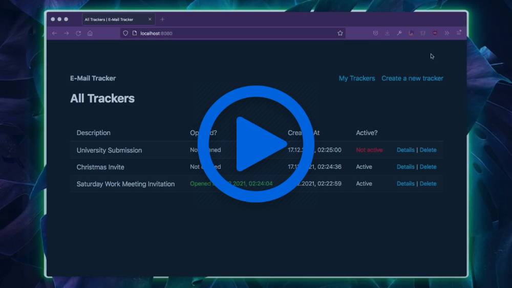

<a href="https://raw.githubusercontent.com/Capevace/email-tracker/main/docs/screenshots/email-tracker.mp4">
    
</a>

# `email-tracker`

> Create trackers that tell you when emails were opened by embedding hidden images

## Usage

### Using with Docker

You can download the package from npm.

```bash
docker pull capevace/email-tracker
```

### Using with npm

You can download the package from npm.

```bash
npm i -g email-tracker
```

## Environment Variables

-   `PORT` (Number): set the port for the HTTP server

    Example:

    ```bash
    PORT=3000 email-tracker
    ```

-   `DB_PATH` (String): set the DB path

    Example:

    ```bash
    DB_PATH=../data/emails.db email-tracker
    ```

## Screenshots

|                                                       |                                                       |
| ----------------------------------------------------- | ----------------------------------------------------- |
|  |  |
|  |  |
|  |  |
|  |  |

## Changelog

### 2.0.1

-   **🩺 Removed documentation images from NPM release (20MB+ -> 17kb package size)**

### 2.0.0

-   **➕ Added header tracking**

    When the hidden image is loaded, header information sent along with the request will be saved in the database. This is useful to determine if the tracker was invoked not by a genuine open, but by a proxy caching email resources beforehand (GMail does this for example).

-   **🩺 Fixed mobile layout issues**

#### Migration notice

If you've previously used v1.0.0, you'll need to run the following SQL
on your SQLite `.db`, in order to make it compatible with v2.0.0:

```sql
ALTER TABLE events
  ADD headers TEXT;
```

### 1.0.0

-   **🚀 Initial release**
